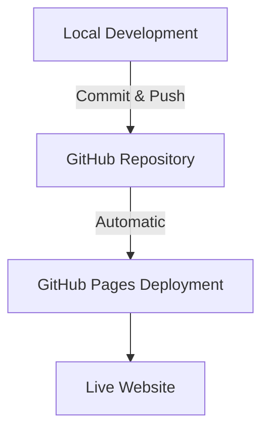
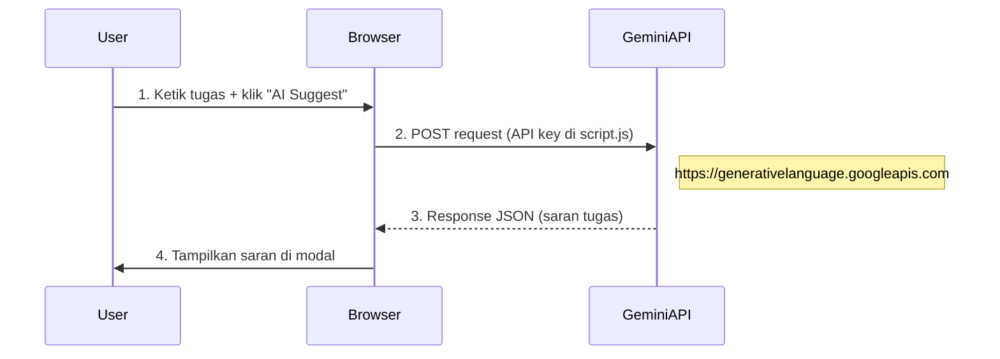
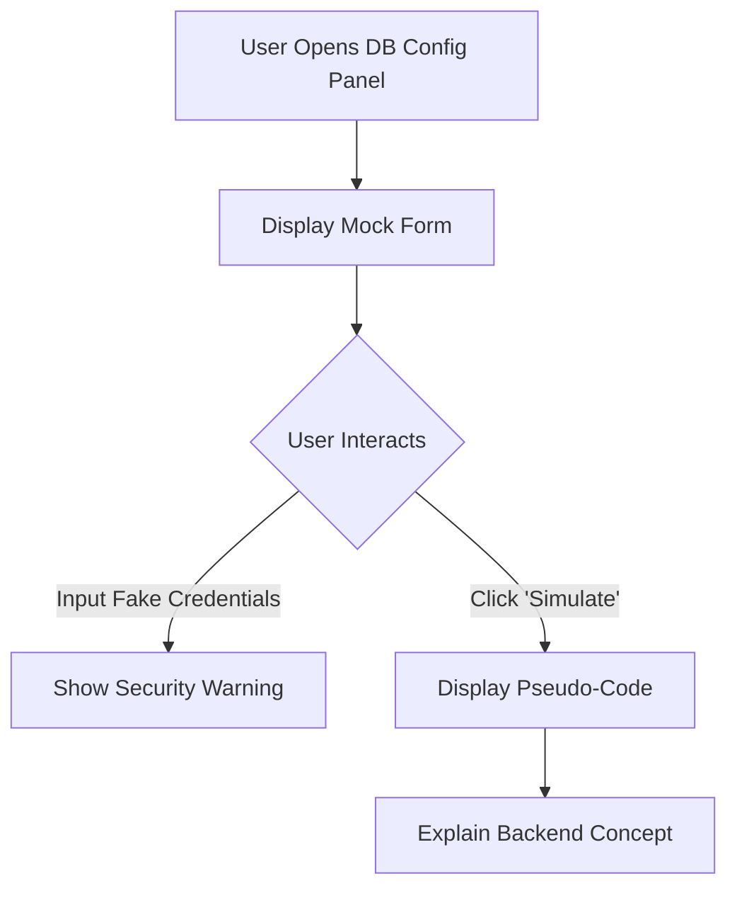
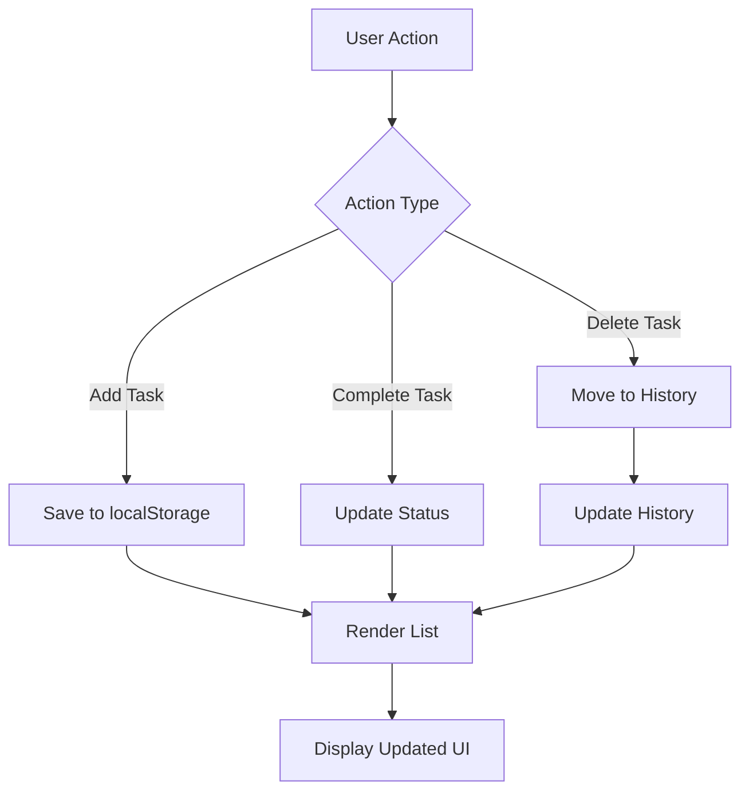

# Aplikasi Web To-Do List

Tugas dari RevoU: To-Do List Web Application

Aplikasi web To-Do List ini adalah alat yang intuitif dan responsif untuk mengelola tugas harian Anda. Dibangun dengan HTML, CSS (menggunakan Tailwind CSS), dan JavaScript murni, aplikasi ini menawarkan fitur-fitur penting seperti penambahan, pengelolaan, pencarian, pemfilteran, dan riwayat tugas, serta integrasi AI dasar dan simulasi konfigurasi database.

## Preview


## Demo
🌐 [Live Demo](https://revou-coding-camp.github.io/codingcamp-7-jul-25-AbyanDimas/)

## Repository
📦 [GitHub Repository](https://github.com/Revou-Coding-Camp/codingcamp-7-jul-25-AbyanDimas)

## Daftar Isi
- [Fitur](#fitur)
- [Teknologi yang Digunakan](#teknologi-yang-digunakan)
- [Instalasi dan Penggunaan](#instalasi-dan-penggunaan)
- [Struktur Proyek](#struktur-proyek)
- [Pintasan Keyboard](#pintasan-keyboard)
- [Integrasi AI (Gemini API)](#integrasi-ai-gemini-api)
- [Simulasi Konfigurasi Database](#simulasi-konfigurasi-database)
- [Responsivitas](#responsivitas)
- [Pengelolaan Data](#pengelolaan-data)
- [Kontribusi](#kontribusi)
- [Lisensi](#lisensi)

## Fitur
- **Tambah Tugas Baru**: Tambahkan tugas dengan teks dan tanggal jatuh tempo opsional.
- **Tandai Selesai/Pending**: Ubah status tugas menjadi selesai atau pending.
- **Hapus Tugas (Soft Delete)**: Pindahkan tugas ke riwayat (tidak dihapus permanen secara langsung).
- **Riwayat Tugas**: Lihat tugas yang telah dihapus dan pulihkan atau hapus secara permanen.
- **Pencarian Tugas**: Cari tugas berdasarkan teks.
- **Filter Tugas**: Filter tugas berdasarkan status (Semua, Selesai, Pending).
- **Hapus Semua Tugas**: Pindahkan semua tugas aktif ke riwayat.
- **Pesan Modal Kustom**: Pengganti `alert()` dan `confirm()` untuk interaksi pengguna yang lebih baik.
- **Integrasi AI (Gemini API)**: Dapatkan saran deskripsi tugas dari AI.
- **Simulasi Konfigurasi Database**: Bagian demo untuk menunjukkan bagaimana kredensial database dapat diatur (dengan peringatan keamanan).
- **Pintasan Keyboard**: Akses cepat ke berbagai fitur menggunakan pintasan keyboard.
- **Desain Responsif**: Antarmuka yang dioptimalkan untuk berbagai ukuran layar (desktop, tablet, mobile).
- **Animasi Halus**: Transisi dan animasi untuk pengalaman pengguna yang lebih baik.
- **Manajemen Tanggal Jatuh Tempo**: Penandaan visual untuk tugas yang akan datang atau sudah lewat jatuh tempo.

## Teknologi yang Digunakan
- **HTML5**: Struktur dasar halaman web.
- **CSS3**: Styling, termasuk:
  - **Tailwind CSS**: Framework CSS untuk utilitas cepat dan desain responsif.
  - **Custom CSS**: Untuk efek glassmorphism, animasi, dan penyesuaian spesifik.
- **JavaScript (Vanilla JS)**: Logika inti aplikasi.
- **Font Awesome**: Untuk ikon-ikon yang digunakan di seluruh aplikasi.
- **Google Fonts (Inter)**: Font yang digunakan untuk estetika.
- **Gemini API**: Untuk fitur saran AI.

## Instalasi dan Penggunaan
Untuk menjalankan aplikasi ini secara lokal:

1. Clone repository:
   ```bash
   git clone https://github.com/Revou-Coding-Camp/codingcamp-7-jul-25-AbyanDimas.git
   ```
2. Navigasi ke folder proyek:
   ```bash
   cd codingcamp-7-jul-25-AbyanDimas
   ```
3. Buka file `index.html` di browser web pilihan Anda.

Atau Anda bisa langsung mengakses [Live Demo](https://revou-coding-camp.github.io/codingcamp-7-jul-25-AbyanDimas/) tanpa perlu instalasi.

# Workflow & Deployment Schema



## Struktur Proyek
```
codingcamp-7-jul-25-AbyanDimas/
├── index.html
├── CSS/
│   └── style.css
└── JS/
    └── script.js
```

## Pintasan Keyboard
Aplikasi ini mendukung pintasan keyboard untuk meningkatkan efisiensi:
- **Enter** (saat di input tugas): Tambah Tugas
- **Esc**: Tutup Modal/Overlay yang aktif
- **Ctrl/Cmd + F**: Buka Modal Filter
- **Ctrl/Cmd + H**: Buka Modal Riwayat
- **Ctrl/Cmd + A**: Memicu Saran AI
- **Ctrl/Cmd + S**: Fokus ke Input Pencarian
- **Ctrl/Cmd + D**: Hapus Semua Tugas (pindahkan ke riwayat)
- **Ctrl/Cmd + N**: Fokus ke Input Tugas Baru
- **Ctrl/Cmd + L**: Muat Ulang Daftar Tugas
- **Ctrl/Cmd + J**: Tampilkan/Sembunyikan Modal Pintasan Keyboard
- **Ctrl/Cmd + K**: Tampilkan/Sembunyikan Bagian Konfigurasi Database

## Integrasi AI (Gemini API)
Aplikasi ini menggunakan Gemini API untuk memberikan saran tugas berdasarkan input pengguna.

**Cara Kerja**: Saat Anda mengetik di kolom tugas dan menekan tombol "AI" atau `Ctrl/Cmd + A`, aplikasi akan mengirim teks Anda ke Gemini API.

**Saran**: AI akan mengembalikan saran deskripsi tugas yang lebih detail atau mengembangkan ide Anda.

**Peringatan**: API Key Gemini saat ini hardcoded di `script.js` untuk tujuan demo (`GEMINI_API_KEY`). Ini tidak direkomendasikan untuk aplikasi produksi karena dapat mengekspos kunci API Anda. Dalam aplikasi nyata, permintaan API ke Gemini harus melalui server backend untuk keamanan.



## Simulasi Konfigurasi Database
Bagian "Konfigurasi Database (Demo)" disertakan untuk mendemonstrasikan bagaimana antarmuka untuk pengaturan database dapat terlihat.

**Tujuan**: Ini adalah simulasi frontend murni. Tidak ada koneksi database yang sebenarnya dibuat dari sisi klien.

**Keamanan**: Bagian ini sengaja menyoroti risiko keamanan menyimpan kredensial database di frontend. Pesan peringatan yang jelas disertakan.

**Tutorial**: Terdapat tutorial pseudo-code yang menjelaskan langkah-langkah untuk menyiapkan database (misalnya PostgreSQL) dan bagaimana backend seharusnya menangani koneksi database yang aman.



## Responsivitas
Aplikasi ini dirancang agar sepenuhnya responsif, memastikan pengalaman pengguna yang optimal di berbagai perangkat:

- **Desktop**: Tata letak dua kolom untuk input dan kontrol.
- **Tablet & Mobile**: Tata letak satu kolom yang disederhanakan, tombol yang disesuaikan, dan ukuran font yang dioptimalkan.
- **Glassmorphism**: Efek visual yang konsisten di seluruh breakpoint.

## Pengelolaan Data
Tugas dan riwayat tugas disimpan secara lokal di browser menggunakan Local Storage.


